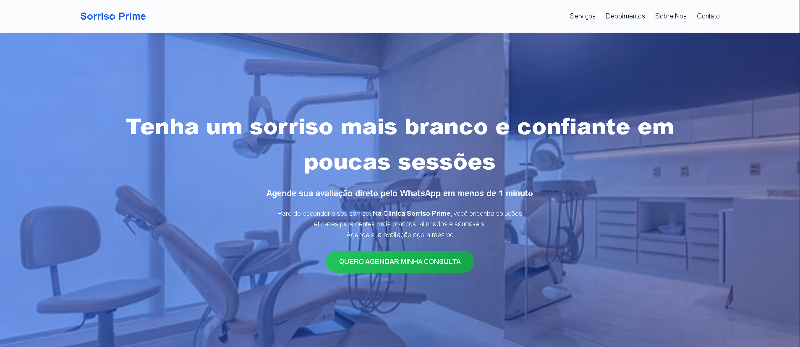

# Landing Page para Clínica Odontológica

Landing page profissional desenvolvida com foco em conversão, ideal para clínicas odontológicas que desejam atrair mais pacientes e aumentar o número de agendamentos.

---

## Acesse o projeto

👉 [Entre no site](https://oalima.github.io/Landing-page-dentista/)

---

## Objetivo do projeto

Este projeto foi criado para demonstrar na prática como uma landing page bem estruturada pode transformar visitantes em clientes.

A página foi construída com foco em:

* Copy estratégica voltada para conversão
* Design moderno e agradável
* Experiência do usuário fluida
* Integração direta com WhatsApp
* Estrutura otimizada para geração de leads

---

## Tecnologias utilizadas

* HTML5
* CSS3
* JavaScript

---

## Preview

---

## Problema que resolve

Muitas clínicas odontológicas perdem pacientes por não terem uma presença digital eficiente.

Esta landing page resolve isso ao:

✔ Gerar mais contatos diretos via WhatsApp
✔ Aumentar a confiança do paciente
✔ Apresentar serviços de forma clara e profissional
✔ Direcionar o usuário para ação (agendamento)

---

## Aplicação real

Este modelo pode ser facilmente adaptado para:

* Clínicas odontológicas
* Profissionais autônomos
* Negócios locais
* Prestadores de serviço

---

## Contato

Se você quer uma landing page como essa para o seu negócio:

Entre em contato comigo e vamos criar algo focado em resultado.
